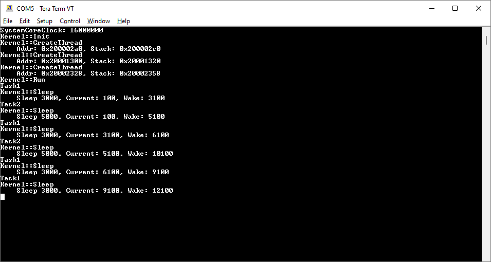
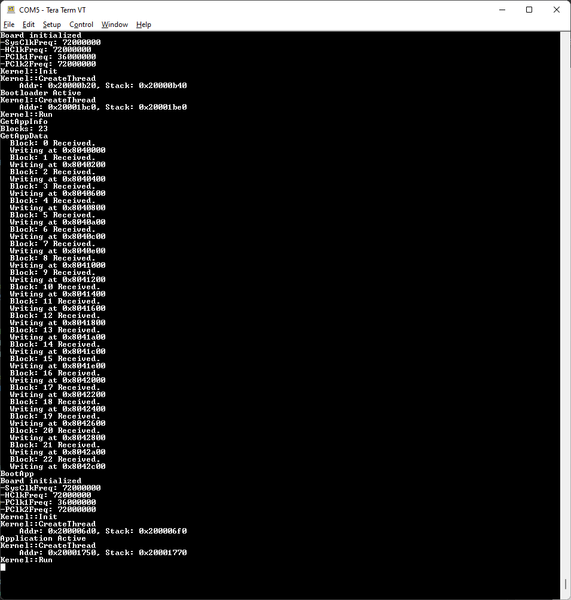

# Embedded
Playing around with bare-metal embedded software without Stm32 HAL / Freedom-SDK.

## Overview
* Bootloader + App
* Bootloader OTA update over UART (using Bluetooth/Hc06).
* Simple Kernel

### Boards
 * [NUCLEO-F746ZG](https://www.st.com/en/evaluation-tools/nucleo-f746zg.html)
 * [HiFive1 Rev B](https://www.sifive.com/boards/hifive1-rev-b)

### Drivers
* GPIO
* Simple UART
* SysTick
* Simple Timer
* Flash
* Spi/DMA

## Demos

### Threading

### Updating

