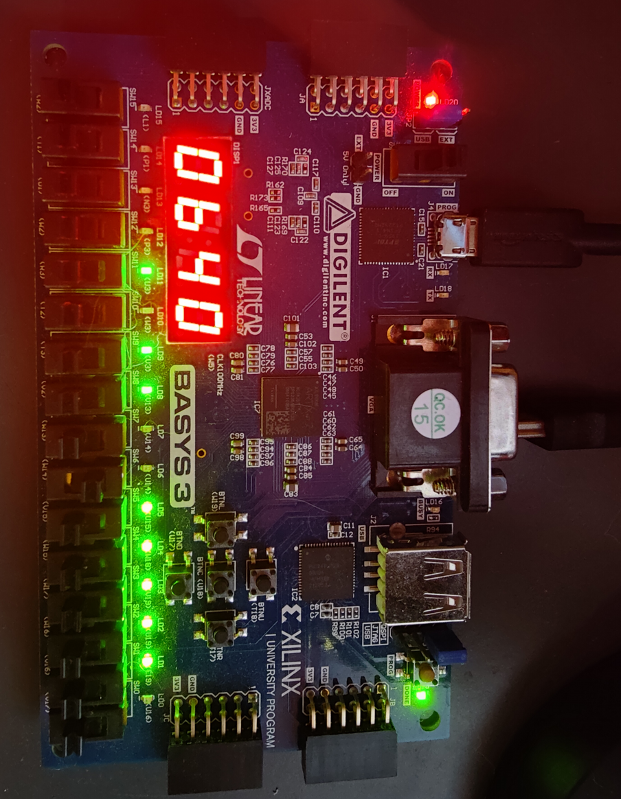

# RiscV

# Building 
1. Build either test program (`count.S` or `demo.c`): ```Programs/<test>/build.sh```
2. Build FPGA: [SOC.xpr](Rtl\SoC.xpr).

# Toolchain
1. Clone: https://github.com/riscv-collab/riscv-gnu-toolchain
2. Build:
```
cd riscv-gnu-toolchain
./configure --prefix=/opt/rv32i --with-arch=rv32i --with-multilib-generator="rv32i-ilp32--"
make
```

# Memory Map
* 0x0000-0x1FFF: Memory
* 0x4000: LED Display
* 0x4004: LED row
* 0x4008: Switches
* 0x4010: UART TX

# Test Programs
* [count.S](Programs/Count/count.S) - Assembly program targetting RiscV SOC
* [demo.c](Programs/Demo/demo.c) - C program targetting RiscV SOC

# Demo
Running on [Basys 3 Artix-7](https://digilent.com/shop/basys-3-artix-7-fpga-trainer-board-recommended-for-introductory-users/)


# Credits
Helpful Tutorials
* https://github.com/martinKindall/risc-v-single-cycle
* https://github.com/BrunoLevy/learn-fpga/blob/master/FemtoRV/TUTORIALS/FROM_BLINKER_TO_RISCV
* https://github.com/cyrozap/osdvu - UART implementation